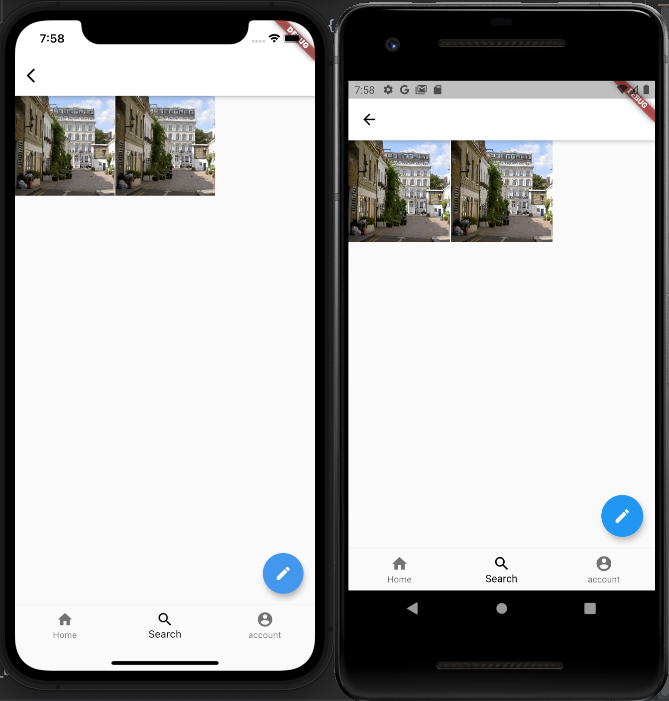
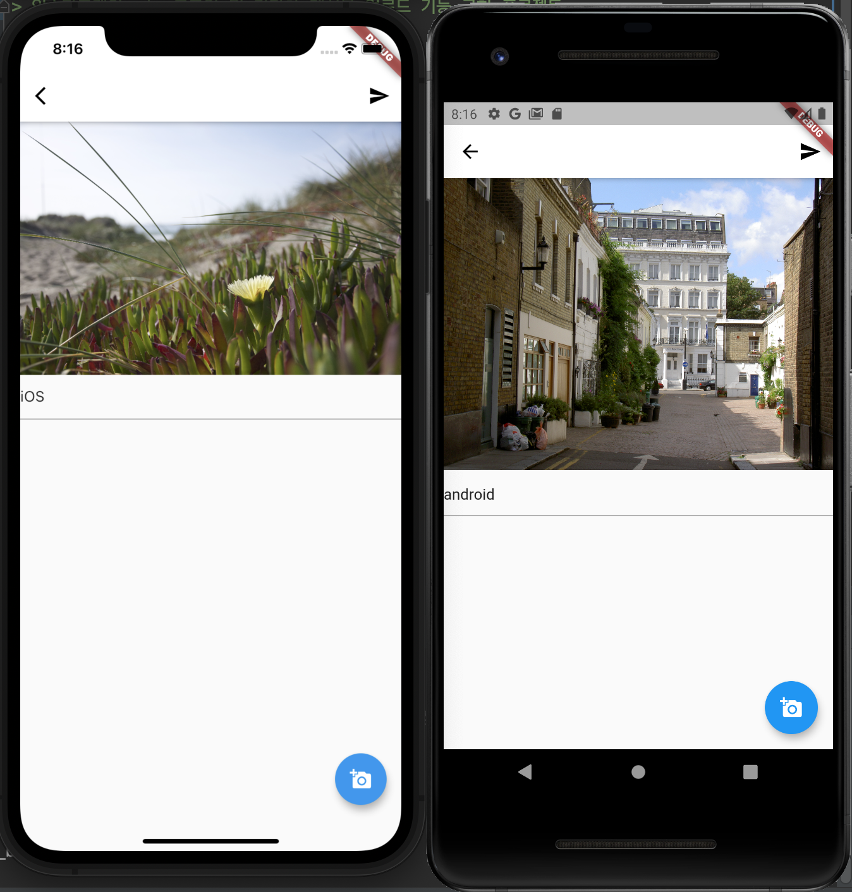
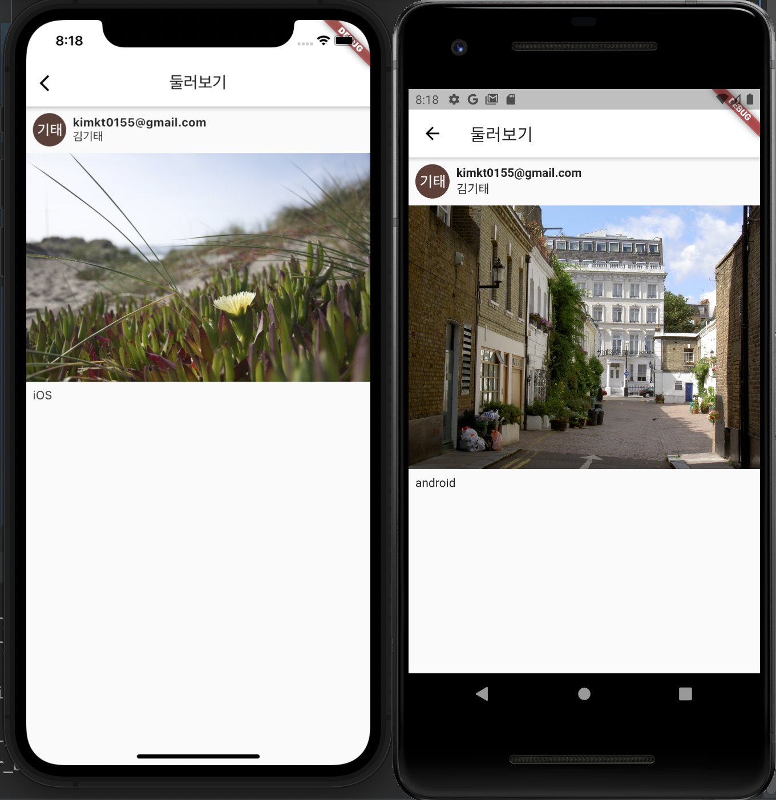
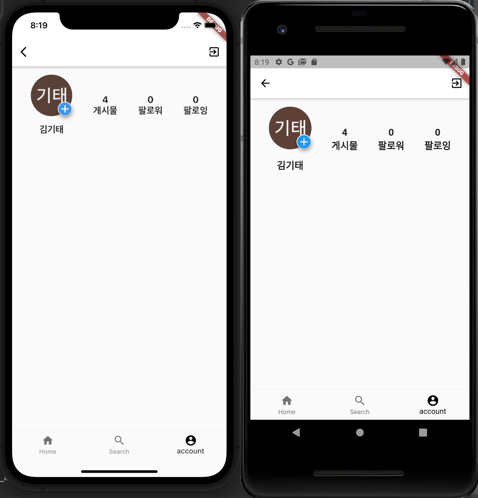

# 플러터트 앱 프로젝트
> StackView, Card, Container, GridView 등 다양한 widget 사용
> 인스타그램의 ui, 로그인 및 간단한 게시물 업로드 기능 구현 프로젝트

## 상세
### 처음 화면

> floatingButton, 버튼, 스위치, 클릭 리스너, 화면전환 등의 간단한 개념
> 인스타그램 클론 버튼을 누른 후의 화면
> {: width="50%" height="50%"}

### 로그인화면

> StreamBuilder를 사용하여 로그인 여부를 판단.
> 로그인 되어있다면 다음 페이지로 넘어감, 도중 로그아웃된다면 로그인 페이지로 넘어감.
> {: width="50%" height="50%"}

### Home

> FirebaseUser정보 이용
> {: width="50%" height="50%"}

### Search

> 계정에 상관없이 데이터베이스 내의 모든 게시물을 보여줌
> {: width="50%" height="50%"}

### Create

> 기기 내의 사진을 선택, 원하는 글을 적은 후 오른쪽 상단 버튼으로
> storage에 이미지 저장, 데이터베이스에 정보 저장
> {: width="50%" height="50%"}
> {: width="50%" height="50%"}

### Selected Post

> 게시물 선택시 게시자 정보, 시진, 작성글을 보여줌
> Hero 위젯을 이용한 선택,뒤로가기 애니메이션
> {: width="50%" height="50%"}

### Account

> Firebase의 간단한 쿼리문을 통한 해당 user의 게시물 개수 표시
> {: width="50%" height="50%"}
